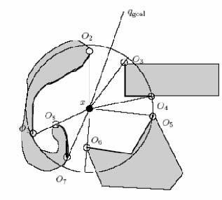
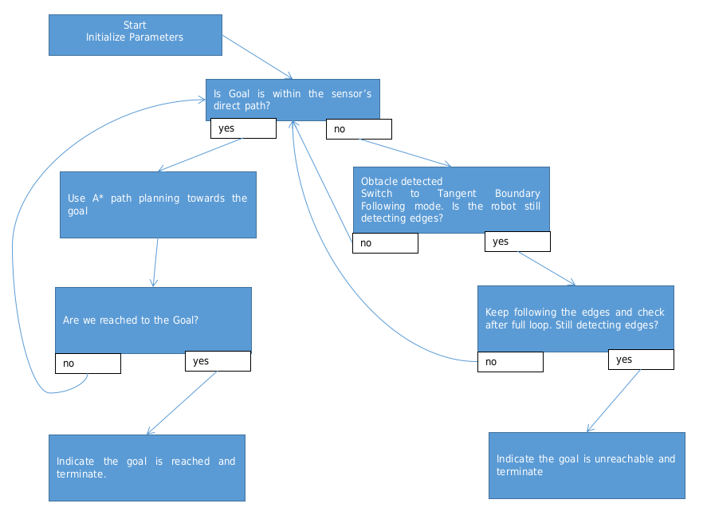
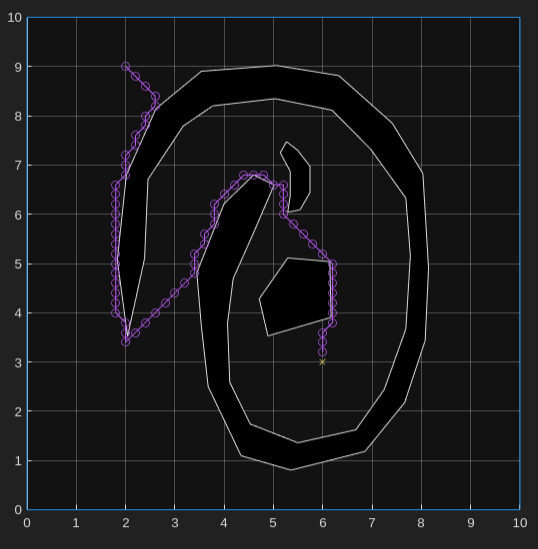
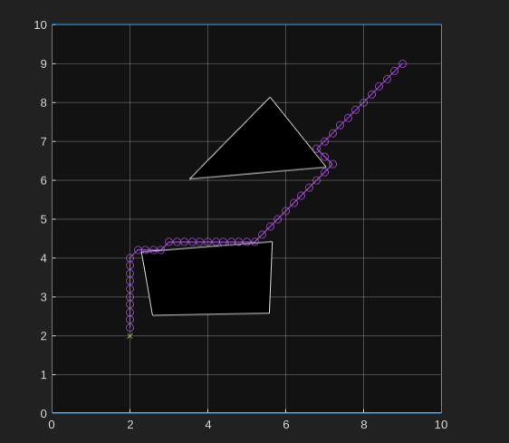
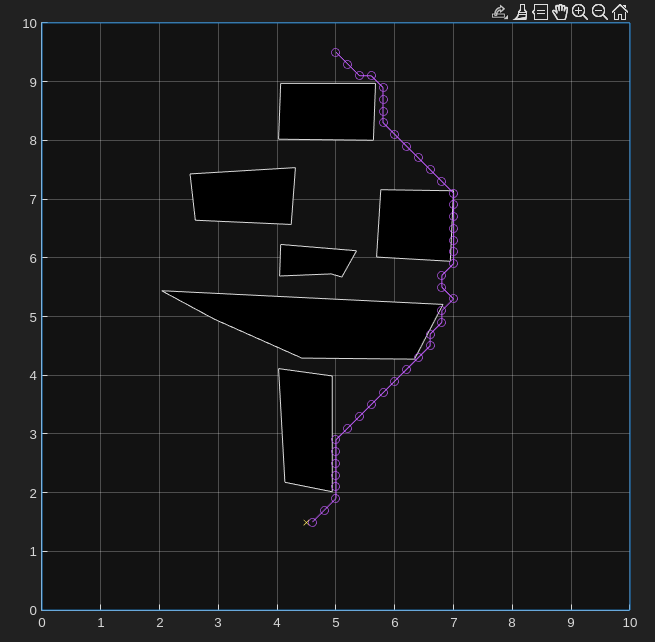
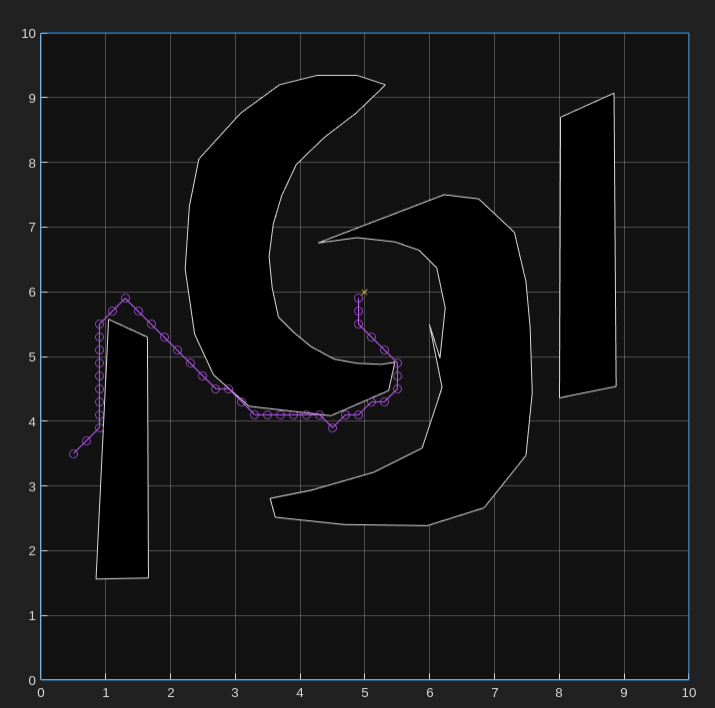

# CENG 786 - ROBOT MOTION PLANNING AND CONTROL
## Assignment #1: Implementing Tangent Bug Algorithm

##### Çağdaş Güven
##### MIDDLE EAST TECHNICAL UNIVERSITY - Robotics 
##### Instructor: Prof. Uluç Saranlı

# Introduction

The **Tangent Bug Algorithm**(3) is a path planning method widely used in robotics for navigating unknown environments while avoiding obstacles. Unlike global planners that rely on full knowledge of the environment, the Tangent Bug Algorithm operates with local sensing, making real-time decisions based on the robot's immediate surroundings. By combining goal-directed movement with obstacle avoidance through boundary-following and tangent-based navigation, the algorithm allows the robot to reach a target efficiently, even in dynamic or partially known environments. This report details the implementation of the Tangent Bug Algorithm, exploring its functionality, performance, and application in real-world scenarios.

>Figure 1 The robot is denoted with x and the goal is qgoal. The discontinuity points are Oi

Here are the key formulas related to the A* algorithm and the Tangent Boundary Following Bug approach:

### 1. **A star Algorithm Formulas**
The A* algorithm is based on evaluating a cost function $ f(x)  $ for each node $  x $

$
f(x) = g(x) + h(x)
$

where:
- $ g(x) $ is the actual cost from the start node to node $x $.
- $h(x) $ is the heuristic estimate of the cost from node $ x $ to the goal.

#### **Cost Calculation**
- **Movement Cost $( g(x) )$**:
  $
  g(x) = g(\text{parent of } x) + \text{cost to move from parent to } x
  $
  The cost can be calculated based on the distance between adjacent nodes, e.g., Euclidean distance:
  $
  \text{cost} = \sqrt{(x_2 - x_1)^2 + (y_2 - y_1)^2}
  $

- **Heuristic Cost $( h(x) )$**:
  Typically, the Euclidean distance from the current node $ x $ to the goal $ q_{\text{goal}} :$
  $
  h(x) = \sqrt{(x - q_{\text{goal}}(1))^2 + (y - q_{\text{goal}}(2))^2}
  $

### 2. **Tangent Boundary Following Formulas**
When encountering obstacles, the robot switches to tangent boundary following. The key formulas are related to maintaining a safe distance and navigating tangentially:

#### **Heuristic for Choosing Boundary Points**
During boundary following, the robot evaluates possible boundary points $ n $ based on a heuristic:
$
\text{Heuristic: } h(x, n) = d(x, n) + d(n, q_{\text{goal}})
$
where:
- $ d(x, n) $ is the distance between the current position $x $ and the boundary point $ n $.
- $ d(n, q_{\text{goal}}) $ is the distance between the boundary point $ n  $ and the goal position.

#### **Maintaining Tangent Distance**
- **Safe Distance**:
  The robot maintains a distance between a minimum $( d_{\text{min}} ) $ and maximum $ (d_{max})  $ threshold:
  $
  d_{\text{min}} \leq \text{distance to obstacle} \leq d_{\text{max}}
  $
- **Perpendicular Adjustment**:
  When the robot gets too close or too far from the obstacle, it adjusts its path:
  $
  \text{Adjustment} = d_{\text{desired}} - \text{distance to obstacle}
  $
where $ d_{\text{desired}}  $ is within the range $ [d_{\text{min}}, d_{\text{max}}]$.

These formulas drive the core logic of our integrated A* and Tangent Bug approach, allowing the robot to plan paths efficiently while avoiding obstacles and maintaining smooth navigation along boundaries when necessary.

### Algorithm Description

The **Tangent Bug Algorithm** is a reactive path planning algorithm designed for robots navigating in environments with obstacles using local sensing. It combines two primary behaviors: 

1. **Goal Seeking**: The robot moves directly toward the target as long as no obstacles are detected in its path.
   
2. **Obstacle Avoidance**: When the robot encounters an obstacle, it computes tangent lines to the obstacle's boundary and selects the best direction to follow. It either follows the boundary or switches back to goal-seeking when it finds a clear path.

By switching between these behaviors, the robot effectively avoids obstacles while continuously trying to minimize the distance to the goal. The algorithm does not require a full map of the environment and relies on local sensor data, making it suitable for unknown or dynamic environments.

# Implementation Details

Here's a breakdown of the implementation details, explaining how the algorithm switches between A* path planning and tangent boundary following, how it detects obstacles, and why implementing tangent following can be challenging.

>flow chart 1 Shows implemented approach

### 1. **Switching Between A* Planning and Tangent Boundary Following**

#### A* Path Planning:
- **Primary Behavior**: The algorithm starts by planning a path using A* search. This mode tries to find a direct path from the start (`qstart`) to the goal (`qgoal`).
- **Path Expansion**: A* explores potential paths by expanding nodes (points in the arena) and calculating the cost (`g_score`), which is the movement cost from the start, and the estimated cost to the goal (`f_score`), which is `g_score + heuristic`.

#### Detecting When to Switch:
- **Obstacle Detection**: During path expansion, the algorithm uses a function (`is_obstacle`) that checks if a move in a particular direction would result in a collision. If an obstacle is detected, the algorithm switches from A* to tangent boundary following.
- **When Tangent Following Starts**: The algorithm enters the tangent boundary-following mode when:
  - The sensor data indicates there is an obstacle blocking the direct path to the goal.
  - The robot is too close to the obstacle and requires careful maneuvering to avoid a collision.

### 2. **How the Algorithm Notices the Obstacle**

#### Sensor-Based Detection:
- **Sensor Mechanism**: The robot is equipped with a 360-degree sensor (`read_sensor`) that measures the distance to the nearest obstacle at any given angle. 
- **Continuous Monitoring**: As the robot navigates, it continuously checks the sensor data in the direction of its intended movement. If the distance is less than a threshold (indicating the presence of an obstacle), it switches to boundary following.
- **Range and Discontinuities**: When the robot sweeps the sensor, it can detect "discontinuities" (figure1) or significant changes in distance measurements. These indicate potential edges or gaps in obstacles, which can be useful for tangent following.

### 3. **How the Algorithm Avoids Obstacles**

#### Tangent Boundary Following:
- **Maintaining a Safe Distance**: Once an obstacle is detected, the robot needs to navigate around it without colliding. The tangent boundary-following behavior helps achieve this by:
  - **Adjusting Position**: When an obstacle is detected, the robot adjusts its position to maintain a distance within a specified range (`min_distance` to `max_distance`). This ensures the robot does not get too close to or too far from the obstacle while following it.
  - **Finding and Following the Boundary**: The algorithm identifies the boundary edges using sensor readings. It then moves tangentially along the obstacle’s boundary, maintaining a safe distance and adjusting the movement if it gets too close or far.

#### Resuming A* Path Planning:
- **Switching Back**: The robot continuously checks if it can see a clear path to the goal while following the boundary. When it detects that the path to the goal is unobstructed, it switches back to A* planning and continues towards the goal.
- **Heuristic and Edge Calculation**: The robot uses a heuristic to determine the shortest path, even while avoiding obstacles. It chooses edges that minimize the total cost (current distance + estimated distance to the goal), helping it make intelligent choices when navigating around obstacles.

### 4. **Why Tangent Following Was Hard to Implement**

#### Challenges with Tangent Following:
1. **Continuous Adjustments**:
   - Unlike simple obstacle avoidance where the robot can stop or turn around immediately, tangent following requires the robot to continuously adjust its path to remain at a safe distance from the boundary. This involves complex calculations to ensure the robot does not oscillate or veer off course.
   - Implementing precise adjustments based on continuous sensor feedback is challenging because any slight delay or incorrect calculation can lead to erratic behavior or collisions.

2. **Determining When to Switch Modes**:
   - One of the biggest challenges is deciding when to switch from tangent following back to A* planning. The algorithm needs to frequently check if the goal is visible and reachable without obstacles, which involves continuously reading sensor data and recalculating paths.
   - Improper switching can cause the robot to get "stuck" in a loop, either constantly switching between modes or failing to leave tangent following even when the path to the goal is clear.

3. **Boundary Edge Detection**:
   - Detecting edges accurately can be difficult, especially when there are complex-shaped obstacles or overlapping obstacles. The robot needs to understand which parts of the sensor readings correspond to actual boundaries and which are just gaps or noise.
   - Misidentification of edges could lead the robot to take inefficient or incorrect paths, making tangent following less effective.

4. **Smooth Path Execution**:
   - Following a smooth, tangential path requires the robot to calculate angles, distances, and adjustments in real-time. Any abrupt changes in direction can lead to jerky movements, which can be particularly problematic when navigating close to obstacles.
   - Implementing smooth path execution involves balancing between avoiding obstacles and maintaining forward progress toward the goal, which is a non-trivial problem in robotics.

# Results and Evaluation

> scenario 1: This is the given example where the algorithm faces non-convex obstacle, local discontuinites, also point where the entrance of spiral has a triangular tip which causes tangential following to break locally.

> scenario 2: This is a simple test constructed with convex obstacles

> scenario 3: This test is similar to the 2nd scenario where the path is actually shorter when the robot avoids obstacles altogether.

>scenario 4: The robot encounters a non-convex obstacle, designed to test its boundary-following behavior. Initially, the robot follows the boundary, but at times the sensor registers maximum readings, causing the robot to switch back to goal-directed motion. When it encounters the obstacle again, it resumes boundary-following.

The algorithm integrates A* path planning with optional tangent boundary following, allowing the robot to navigate complex environments effectively:
1. **A star Path Planning** ensures the robot follows a globally optimal path to the goal. The algorithm expands nodes based on cost (`g_score`) and estimates distance to the goal (`f_score`).
2. **Tangent Boundary Following** activates when obstacles block the path. The robot uses sensor data to detect and navigate around obstacles, maintaining a safe distance. This mode terminates once a clear path to the goal is visible, allowing the robot to switch back to A*.

Compared to the **TangentBug** algorithm by Kamon et al(1)., my method uses a similar local-global approach but relies on A* for efficient global pathfinding, with tangent following providing localized obstacle navigation(1). Similar to the **JAUS compliant mobile robot control**, our tangent following can be adapted for real-world conditions by accounting for robot dimensions, ensuring feasible boundary-following paths(2).

# Discussion

Implementing the algorithm with both A* and optional tangent following required addressing several key challenges and considerations:

1. **Dynamic Adjustments**: The algorithm dynamically adjusts the robot's path based on real-time sensor data, which posed challenges in maintaining smooth movements. The robot's motion can become abrupt, especially when navigating around irregular surfaces. Ensuring a consistent distance from obstacles is essential, but it requires precise tuning of parameters such as step size and sensor sensitivity. This challenge echoes the adaptability observed in **TangentBug** approaches , where continuous adjustments are necessary to maintain efficient navigation.

2. **Seamless Mode Switching**: One of the core aspects was ensuring a smooth transition between A* pathfinding and tangent following. The robot must reliably detect when it can resume direct movement towards the goal without getting stuck in a boundary-following loop. This switch is crucial, as it mirrors the global convergence condition seen in **TangentBug**(1,2) algorithms . Effective mode switching improves navigation efficiency, but it can also lead to issues if not managed carefully, such as the robot straying from the optimal path or failing to exit tangent mode.

3. **Practicality of Tangent Paths**: Real-world implementations often reveal the complexity of adapting local pathfinding to global objectives. Local tangent paths, guided by sensor readings, must integrate smoothly into the overall A* trajectory. Although our approach dynamically uses local sensor data, achieving seamless integration into global planning remains a complex task, especially in environments with irregular or dynamic obstacles. Experiences from **LTG-based methods**(3) suggest the need for adaptive local graphs to handle such complexities, and similar adjustments might improve our tangent-following approach.

4. **Algorithmic Components and Adjustments**: Various algorithmic components were integrated, including:
   - **A* Pathfinding**: This serves as the global planner, calculating the shortest path to the goal based on the heuristic distance. The step size in A* determines how granular the movement is, influencing both the smoothness of the path and the computational load.
   - **Tangent Boundary Following**: When obstacles block the direct path, the robot switches to tangent following, aiming to navigate around the obstacle while maintaining a set distance. This transition is controlled by the distance readings from sensors and the proximity to detected edges. However, achieving consistent and accurate tangent paths requires further refinement.

5. **Performance Analysis**:
   - **Positive Scenarios**: In open environments with minimal obstacles, the algorithm effectively uses A* to navigate directly to the goal, with occasional tangent corrections. These conditions allow the robot to leverage both fast path planning and dynamic adjustments to minor obstacles without significant detours.
   - **Negative Scenarios**: Complex environments with narrow passages and irregular obstacles highlighted the need for improved tangent following. There were instances where the robot struggled to maintain a smooth tangent path, especially when obstacles had jagged surfaces. Additionally, sensor range limitations can cause the robot to misjudge clear paths, leading to premature or excessive boundary following.
   - **Dependence on Parameters**: The robot's performance depends heavily on parameters like sensor range, step size, and distance thresholds for tangent following. For example:
     - **Sensor Range**: A shorter sensor range can limit the robot’s ability to detect upcoming obstacles, forcing it into frequent tangent modes. Conversely, an extended range could lead to unnecessary detections and switching.
     - **Step Size**: Larger step sizes may cause the robot to overshoot or miss critical points, while smaller steps increase precision but reduce speed and efficiency. Balancing these aspects is crucial for optimizing both global pathfinding and local adjustments.

6. **Further Refinements Needed**: Currently, there are some issues where the robot's plotting starts from an incorrect position after a tangent switch. Further refinements are needed to address this and ensure the robot maintains correct behavior after mode transitions. For now, tangent following remains an optional feature, intended for visual inspection and testing. Future improvements could focus on better integration of tangent paths into the overall route, as well as refining the decision-making process when switching modes.

# Conclusion

The integration of A* planning with tangent boundary following allows for a more intelligent navigation system. A* provides an overall path to the goal, while tangent following ensures that the robot can handle obstacles gracefully when they block its path. Despite the challenges, combining these approaches gives the robot flexibility in different environments, allowing it to adapt to both open spaces and more cluttered, obstacle-heavy areas.

# References

1. Minegishi, D., Kobayashi, K., & Watanabe, K. (2010). A study of JAUS compliant mobile robot control by using Tangent Bug Algorithm. *SCIS & ISIS 2010, Okayama Convention Center, Japan*, pp. 1186-1189. Hosei University, Tokyo, Japan.

2. Kamon, I., Rivlin, E., & Rimon, E. (1998). TangentBug: A range-sensor-based navigation algorithm. *The International Journal of Robotics Research, 17*(9), 934-953. Sage Publications.

3. Choset, H., Lynch, K., Hutchinson, S., Kantor, G., Burgard, W., Kavraki, L., & Thrun, S. (2005). *Principles of Robot Motion: Theory, Algorithms, and Implementations*. MIT Press.
